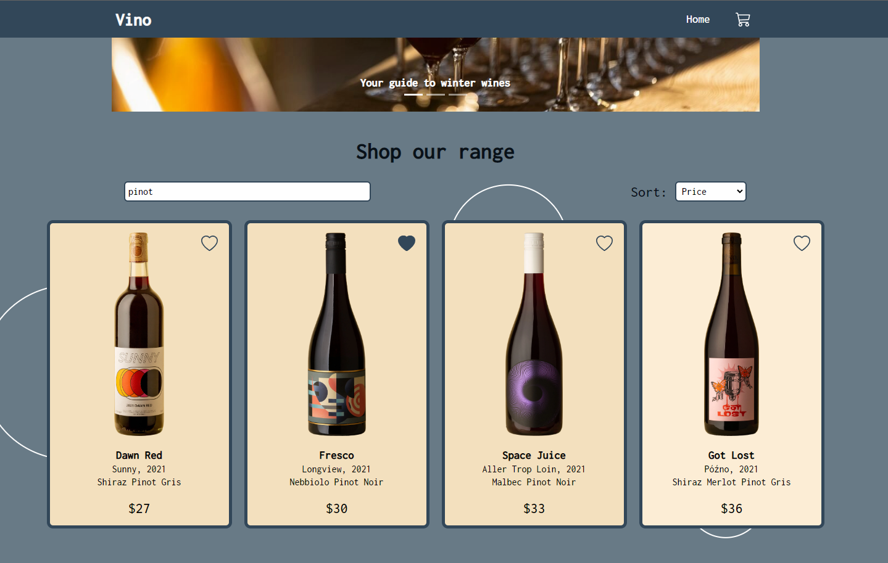

# React E-Commerce App

 

# Task breakdown

### Home Page

-   A Grid of products
-   Carousel of featured products
-   Product Page (with id parameter) Similar to a product page on another site, allows you to add to cart and select product variants

### Firebase/Firestore:

-   quantity
-   variants (could be colors, sizes, etc)
-   price per unit
-   name
-   image url
-   favourited or not (boolean)
-   All data should be stored in Firestore and fetched by the frontend, there should be NO static product data in the react application

### Cart system

-   Logic to prevent users from adding items that are no longer in stock
-   List of products in cart
-   Ability to change quantity of products in cart
-   Ability to remove items from cart

 

# Setup

-   npm install
-   `npm install react-icons --save`
-   `npm install react-bootstrap bootstrap`

    -   I didn't want to use full bootstrap styling so navigative to `App.scss`, ctrl+click on the `~bootstrap/scss/_carousel.scss` link
        and add to `_carousel.scss`.

            @import "functions";
            @import "variables";
            @import "mixins";

-   npm start

 

# Additional features

-   Database interface where products can be added/removed/updated
-   Stock altered in database when a cart of items is checked out
